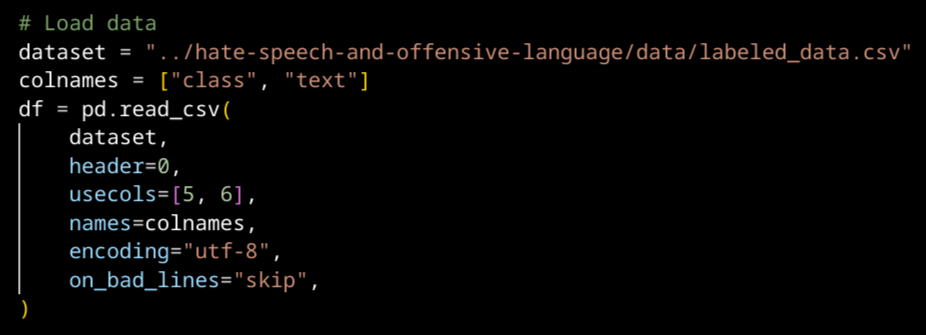
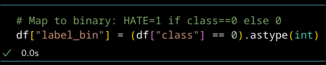
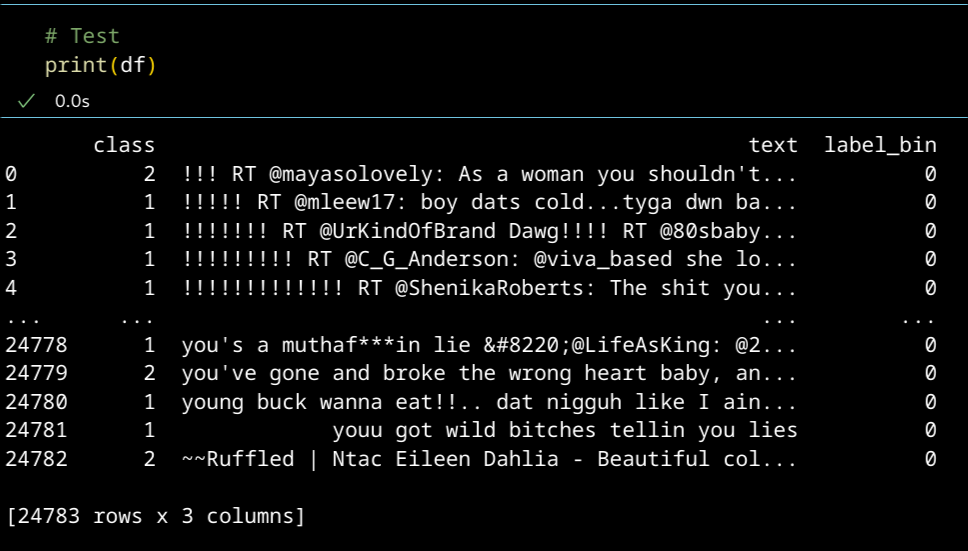
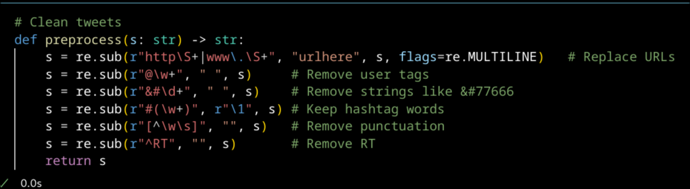
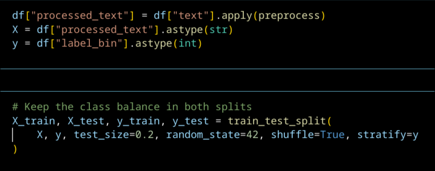
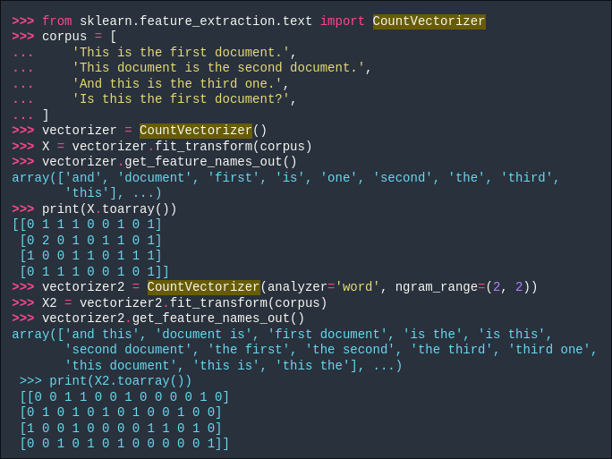
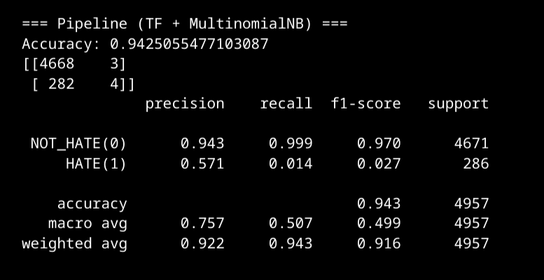
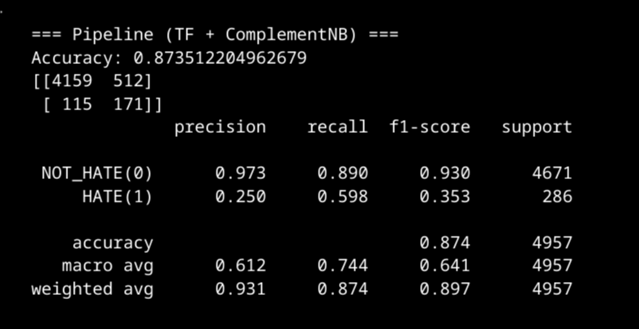

# 37: Naive Bayes

## Naive Bayesin toimintaperiaate

## Vihapuheen tunnistus

Tavoitteena on kouluttaa Naive Bayes -luokittelija, joka osaa tunnistaa, onko twiitti vihapuhetta vai ei. 

### Datasetin käsittely

Tässä tehtävässä tarvitaan vain twiitin teksti ja luokitus. Datasetin 5 ensimmäistä pystyriviä voidaan pudottaa. Teen sen pd.read_csv -funktion usecols-parametrilla.

Datasetissä on luokat 0 (vihapuhe), 1 (loukkaava puhe) ja 2 (ei kumpikaan). Teen uuden pystyrivin, jossa on luokat 1 (vihapuhe) ja 0 (ei vihapuhe).

Käsittelen datasetin poistamalla siitä epäolennaiset merkit ja merkkijonot. Tässä opin, että ^ voi tarkoittaa regexissä negaatiota kun sitä käytetään setin sisällä. Sitä käytetään näin alla olevan kuvan regexissä ryhmässä [^\w\s]. Tässä tunnistetaan merkit, jotka eivät kuuluu kirjaimiin, numeroihin, ole _ tai ole whitespacea.

Jaan datan koulutussettiin sekä testaussettiin. Kattattaa käyttää parametria stratify, koska se varmistaa, että jokaisessa jaossa on sama suhde jokaista luokkaa. Muuten saattaisi olla, että koulutussetissä olisi vaikka enemmän vihapuhetta kuin testaussetissä.[^stratify][^traintestsplit]

### Vektorisointi

Käytän luokkaa TfidfVectorizer. Tämä yhdistää luokat CountVectorizer ja TfidfTransformer. Käyn läpi nämä luokat erikseen.

#### CountVectorizer [^countvectorizer]

Seuraava kuva scikit-learnin dokumentaatiosta selittää luokan toimintaperiaatteen hyvin. Luokka tekee matriisin tekstidokumenttien piirteistä. Piirteen voivat olla yksittäisiä sanoja, sana n-grammeja tai merkki n-grammeja. N-grammi on tietty sanojen tai merkkien ketju. Esimerkissä sekä harjoituksessa käytän sana n-grammeja.

Yksi rivi edustaa yhtä dokumenttia, ja sarake edustaa yhtä piirrettä (n-grammia). Matriisin ruudussa oleva luku merkitsee, kuinka monta kertaa piirre esiintyy dokumentissa.

Parametrilla ngram_range voidaan antaa ylä- ja alaraja hyväksyttävien n-grammien pituudelle. 

#### TfidfTransformer [^tfidftransformer]

Tf on term-frequency eli kuinka monta kertaa termi esiintyy dokumentissa. Tf-idf on term-frequency kerrottuna arvolla inverse document frequency.

Luokka muuntaa matriisin normalisoituun tf- tai tf-idf-esitysmuotoon. Kumpaa käytetään riippuu parametrin use_idf arvosta. Jos parametri on True, matriisissa jo olevista tf-arvoista (CountVectorizer tuottaa nämä arvot) tulee laskea tf-idf -arvot. Idf-arvo lasketaan yhdelle termille seuraavalla kaavalla:

* n_docs on dokumenttien lukumäärä
* df(t) on lukumäärä dokumentteja, jotka sisältävät termin
* Mitä pienemmässä määrässä dokumentteja sana ilmestyy, sitä suurempi arvo on

Kaavassa jakajaan ja jaettavaan lisätään 1, jotta vältetään tapaukset joissa jaetaan nollalla. Tälla on sama vaikutus, kuin jos luotaisiin kuvitteellinen dokumentti jossa esiintyy jokainen piirre kerran.

Seuraavaksi kerrotaan tf-arvo idf-arvolla, jotta saadaan tf-idf -arvo.

Sitten L2-normalisoidaan tf- tai tf-idf -arvot. 

Katso seuraava esimerkkilasku.

##### Esimerkkilasku

Dokumentit ja niiden sanat

| Document | cat | sat | on  | the | mat | dog | barked |
| -------- | --- | --- | --- | --- | --- | --- | ------ |
| doc1     | 1   | 2   | 0   | 0   | 0   | 0   | 0      |
| doc2     | 1   | 1   | 1   | 1   | 1   | 0   | 0      |
| doc3     | 0   | 0   | 0   | 0   | 0   | 1   | 1      |

Sanojen dt (document frequency) arvot

| Term   | df  |
| ------ | --- |
| cat    | 2   |
| sat    | 2   |
| on     | 1   |
| the    | 1   |
| mat    | 1   |
| dog    | 1   |
| barked | 1   |

Lasketaan idf-arvot sanoille (t)

n_docs = 3

**cat, sat:**

$idf=log⁡((3+1)/(2+1))+1=log⁡(4/3)+1≈1.2877$

**on, the, mat, dog, barked:**

$idf=log((3+1)/(1+1))+1=log(2)+1≈1.6931$

**doc1:**

cat: 

$1×1.2877=1.2877$

sat: 

$2×1.2877=2.5754$

Lasketaan arvot kaikille dokumenteille.

doc1: [1.2877, 2.5754, 0, 0, 0, 0, 0]

doc2: [1.2877, 1.2877, 1.6931, 1.6931, 1.6931, 0, 0]

doc3: [0, 0, 0, 0, 0, 1.6931, 1.6931]

Dokumentin idf-arvoille lasketaan L2 normalisaatioarvo, mikä tekee dokumenttien pituudesta merkityksettömän. Arvo lasketaan erikseen jokaiselle dokumentille.

**doc1:**

Norm = $\sqrt{1.28772^2+2.57542^2+0^2+0^2+0^2+0^2+0^2}≈2.876$

Normalisoitu arvo saadaan laskemalla: $idf/norm$

doc1: [0.447, 0.895, 0, 0, 0, 0, 0]

doc2: [0.408, 0.408, 0.537, 0.537, 0.537, 0, 0]

doc3: [0, 0, 0, 0, 0, 0.707, 0.707]

### Luokittelijan kouluttaminen

Käytin ensin MultinomialNB-luokkaa, mutta se suoriutui tehtävästä kammottavan huonosti. Kokeilin siis luokkaa ComplementNB, joka suoriutui huomattavasti paremmin. Tämä olikin oletettavissa, koska scikit-learnin dokumentaatiokin sanoo complement naive Bayesin toimivan yleensä paremmin tekstin luokittelussa kuin multinomial naive bayes. [^complement]

Eron MultinomialNB:n ja ComplementNB:n välillä näkee selvästi seuraavasta kahdesta kuvasta.

MultinomialNB:llä vihapuheen recall-arvo on surkean pieni (0.014). Tämä tarkoittaa, että 1.4% vihapuheesta tunnistettiin. ComplementNB:llä vihapuheen recall on 0.598, eli melkein 60% oikeasta vihapuheesta tunnistettiin vihapuheeksi. 

Nämä tulokset ovat vielä ongelmallisia, kuten vihan precision-arvosta näkee. Vihapuheeksi tunnistetuista viesteistä vain neljännes oli oikeasti vihapuhetta. Tämä luokittelija siis tuottaa paljon vääriä positiivisia.

## Lähteet

[^stratify]: scikit-learn. Cross-validation iterators with stratification based on class labels. https://scikit-learn.org/stable/modules/cross_validation.html#stratification

[^traintestsplit]: scikit-learn. sklearn.model_selection.train_test_split. https://scikit-learn.org/stable/modules/generated/sklearn.model_selection.train_test_split.html#sklearn.model_selection.train_test_split

[^countvectorizer]: scikit-learn. sklearn.feature_extraction.text.CountVectorizer. https://scikit-learn.org/stable/modules/generated/sklearn.feature_extraction.text.CountVectorizer.html

[^tfidftransformer]: scikit-learn. sklearn.feature_extraction.text.TfidfTransformer. https://scikit-learn.org/stable/modules/generated/sklearn.feature_extraction.text.TfidfTransformer.html#sklearn.feature_extraction.text.TfidfTransformer

[^complement]: scikit-learn. Naive Bayes. https://scikit-learn.org/stable/modules/naive_bayes.html#complement-naive-bayes