# 38-39: Päätöspuu

Päätöspuu on ohjattu koneoppimisalgoritmi, joka perustuu hierarkiseen puumalliin. Puun tavoitteena on jakaa päätökset niin, että keskimääräinen päätösten määrä saadaan mahdollisimman pieneksi. Pitää siis valita attribuutti, jota solmussa testataan. Attribuutti tyypillisesti valitaan informaation kasvun tai Gini-epäpuhtauden avulla.[^ibmtree]

## Entropia

Entropia mittaa datan epäpuhtautta tai epäjärjestystä. Tämän voi myös ajatella niin, että entropia mittaa päätöksen epävarmuutta. Kun entropia laskee, oikeaan tulokseen pääsee pienemmällä määrällä kysymyksiä. Puun tavoitteena on siis minimoida sisältämänsä entropia. [^sourander][^khanentropy]

Entropian arvo on 0:n ja 1:n välillä binäärisessä luokittelussa. Kun luokkia on enemmän, arvo on välillä [0, log_2(C)], missä C on luokkien määrä. Kun entropia on 0, valinnassa on vain 1 vaihtoehto. Kun se on maksimiarvossaan, valinnassa kaikki vaihtoehdot ovat yhtä todennäköisiä. Entropian arvo lasketaan seuraavalla kaavalla.[^ibmtree][^geekgini]

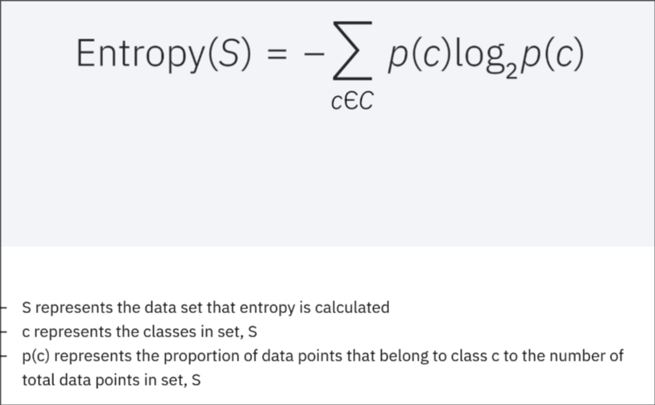
*Entropian kaava.*

## Informaation kasvu (information gain)

Informaation kasvu mittaa entropian muutosta attribuutin perusteella tehdyn jaon jälkeen. Se on erotus vanhemman solmun entropiasta ja sen lapsisolmujen painotetun keskiarvon entropiasta. Attribuutti, jolla on korkein informaation kasvu on paras.[^sourander][^ibmtree]

Lasketaan tällä kaavalla:

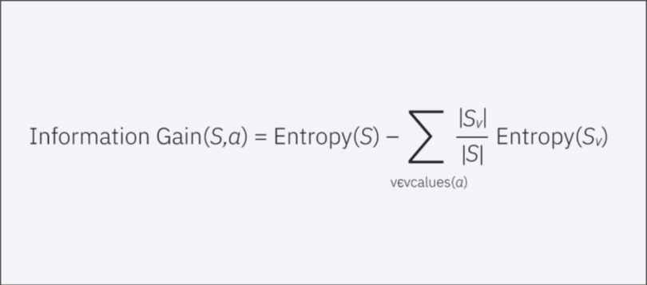

- *S* on datasetti S.
- $Entropy(S)$ on dataseting S entropia.
- *a* on attribuutti tai luokka, jonka suhteen harkitaan datasetin jakoa.
- $v \in \mathrm{values}(a)$ on ominaisuuden a mahdolliset arvot.
- $S_v$ on S:n osajoukko, jolla on arvo v.
- $∣S_v​∣/∣S∣$ on osajoukon $S_v$ osuus datasetistä $S$.
    - Joukon $S_v$ pituus jaettuna $S$:n pituudella.
    - Tämä toimii painona.
- $Entropy(S_v)$ on osajoukon $S_v$ entropia.
    - Eri osajoukoilla on eri entropia.

Informaation kasvu lasketaan jokaiselle attribuutille, ja korkeimman arvon omaava attribuutti valitaan puun alkusolmuksi. Sama prosessi toistetaan puun seuraavien solmujen kohdalla.[^ibmtree]

## Gini-epäpuhtaus (Gini impurity)

Gini-arvolla lasketaan todennäköisyys, että datasetistä satunnaisesti valittu luokitellaan väärin. Vaatii vähemmän laskentatehoa, kuin informaation kasvu.[^ibmtree]

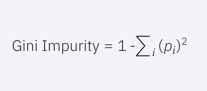
*Gini-epäpuhtauden kaava.*

## Satunnaismetsä (random forest)[^ibmforest][^sourander]

Koneoppimisalgoritmi, joka yhdistää usean päätöspuun tuotokset. Päätöspuilla on tapana vinoutua ja ylisovittua. Puiden yhdessä käyttäminen antaa tarkemman tuloksen. 

Jokainen puu on erilainen toisiinsa verrattuna. Tämä tapahtuu kahdella tavalla:
* Bagging, eli vaihe jossa koulutusdatasta otetaan satunnainen otos jokaiselle puulle. With replacement tai without replacement.
* Random subspace method / feature bagging. Tämä tarkoittaa, että jokainen puu käsittelee vain satunnaisesti valitun osion datan piirteistä.

Regressio-ongelmissa puiden tuloksista otetaan keskiarvo. Luokitteluongelmissa puut äänestävät oikeasta tuloksesta.

## Mallin kouluttaminen

Koulutan satunnaismetsän, koska sen sanotaan tuottavan parempia tuloksia kuin yksittäisen puun.

### Datan analysointi

Datassa on joissain sarakkeissa puuttuvia arvoja.

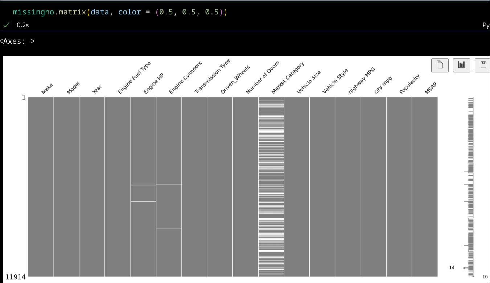
*Muuttujien NaN-arvot visuaalisesti.*

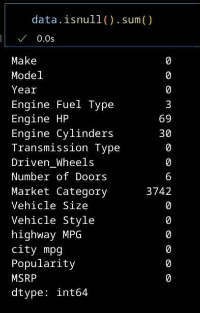
*Muuttujien NaN-arvot numeerisesti.*

Automaattiset ja manuaaliset vaihteistot ovat yleisimpiä. 

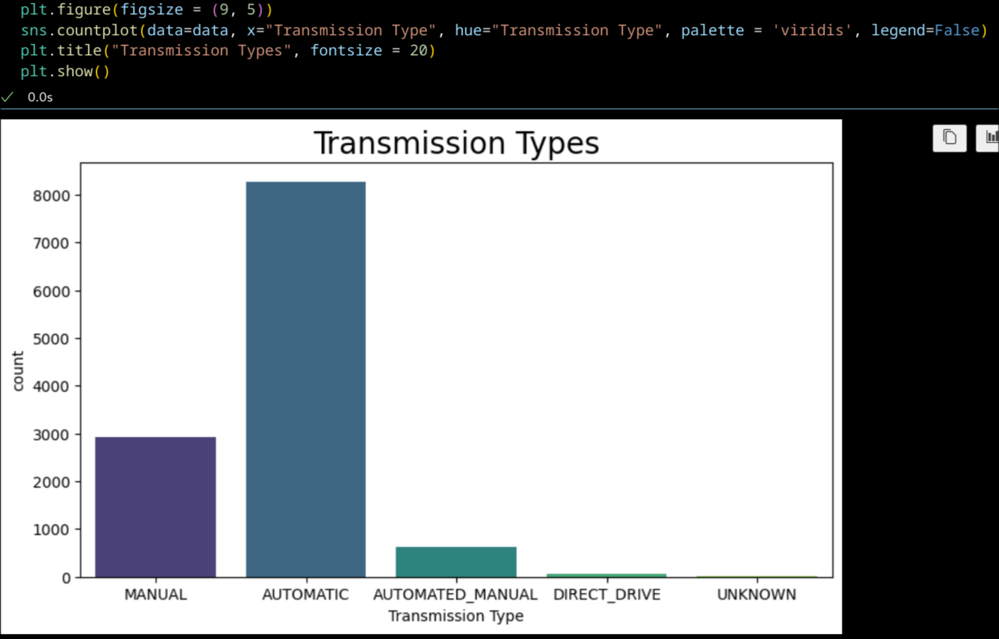
*Autojen vaihteistojen tyypit.*

Make ja model sisältävät paljon uniikkeja arvoja.

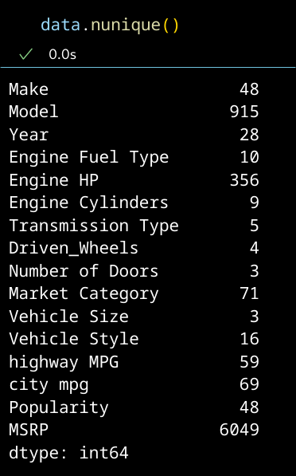
*Jokaisen muuttujan uniikit arvot.*

Engine Cylinders on NaN autoilla, jotka ovat sähköautoja tai Mazdoja. Tutkin kyseisiä Mazdoja, ja paljastui, että ne käyttävät wankelmoottoria. Sähkö- ja wankelmoottorit eivät sisällä sylintereitä. Kaikilla sähköautoilla Engine Cylinders ei ole NaN, vaan joillakin se on 0.

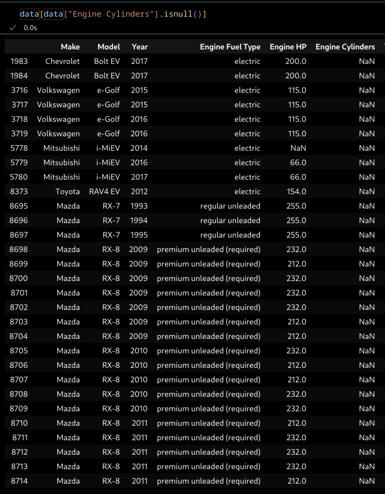
*Joillain sähköautoilla ja kaikilla wankelmoottorin omaavilla autoilla Engine Cylinders on 0.*

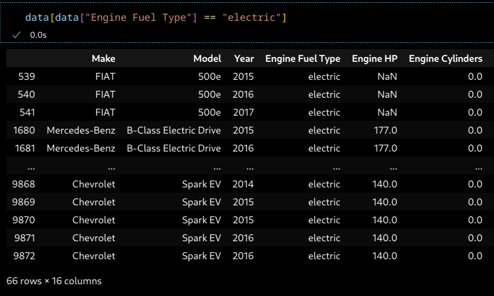
*Mikä Engine Cylinders -arvo sähköautoilla?*

### Datan käsittely

Täytän puuttuvat arvot, sekä vaihdan DIRECT_DRIVE:n sekä AUTOMATED_MANUAL:in AUTOMATIC:iksi koska ne muistuttavat enemmän automaattista vaihteistoa kuin manuaalista. Poistan Market Categoryn kokonaan, koska siinä on niin paljon puuttuvia arvoja.

Yhdistän myös kentät Make ja Model, asetan Engine Cylinders:ssä olevat NaN-arvot 0:ksi (sähkö- ja wankelmoottorit).

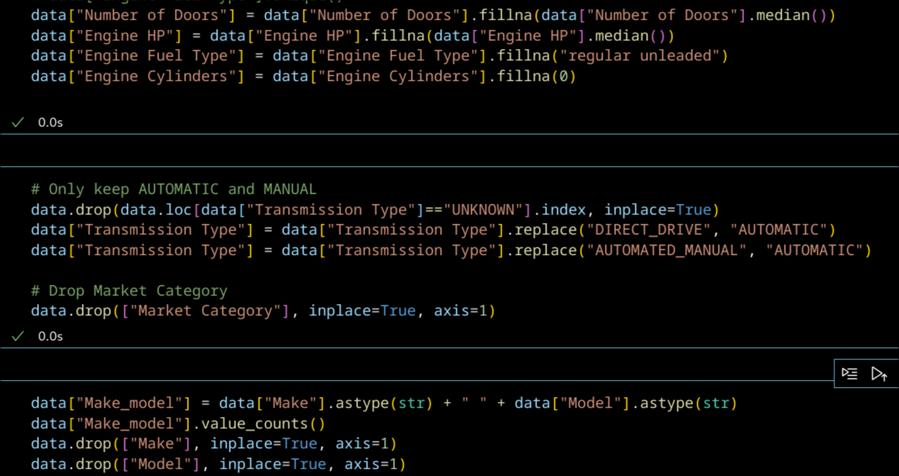
*Puuttuvien arvojen täyttäminen.*

Jaan muuttujat kategorisiin ja numeerisiin muuttujiin. 

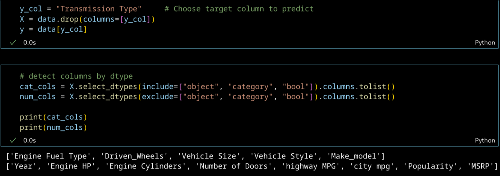
*Muuttujien jako.*

Kategoriset muuttujat tulee enkoodata numeroiksi, koska scikit-learnin päätöspuut eivät tue kategoristen muuttujien suoraa käyttöä. Voisin enkoodata ne suoraan kokonaisluvuiksi, mutta siinä olisi se riski, että malli alkaisi tulkitsemaan korkeampia kokonaislukuja korkeamman arvon omaavina. Kategoristen muuttujien kanssa asia ei ole näin. Siksi one hot enkoodaus on parempi vaihtoehto. Siinä jokaisesta kategoriasta tehdään binäärimuuttuja. Tämän datan tapauksessa, jos yksi Make_model one hot enkoodattu kategoria on 1, kaikki muut Make_model kategoriat ovat 0 kyseisellä rivillä.

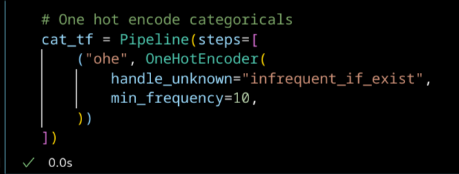
*OneHotEncoder kategorisille muuttujille.*

Voisin myös käsitellä numeeriset muuttujat imputerilla, jos en olisi jo käsitellyt niitä aiemmin.

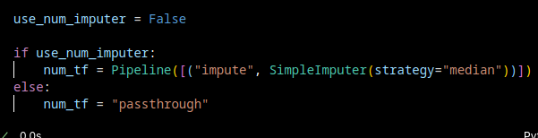
*Imputer numeerisille muuttujille.*

### Satunnaismetsän kouluttaminen

Ajan Pipelinen avulla datan OneHotEncoderin sekä RandomForestClassifierin läpi. RandomForestClassifier hoitaa satunnaismetsän rakentamiseen kuuluvat vaiheet, jonka ansiosta ei ole tarpeellista implementoida aiemmin käsittelemääni teoriaa.

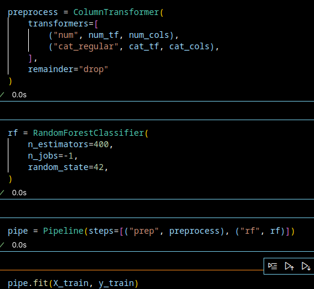
*Pipelinen ajo.*

400:lla puulla satunnaismetsä tuottaa tarkan tuloksen.

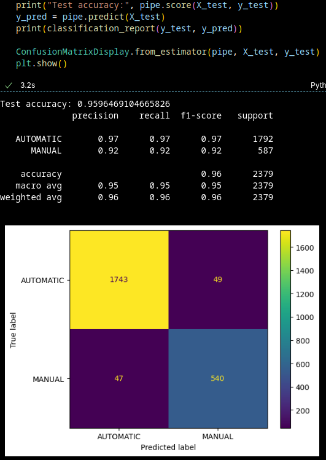
*Satunnaismetsä 400:lla puulla.*

Kokeilen satunnaismetsää pienemmällä ja pienemmällä puumäärällä. Puumäärän alittaessa 15.sta, huomaan suorituskyvyn todella huononevan. Huomaan myös, että suorituskyky on huonompi kun puita on parillinen määrä. Seuraavassa kuvassa tulos 14:sta puulla.

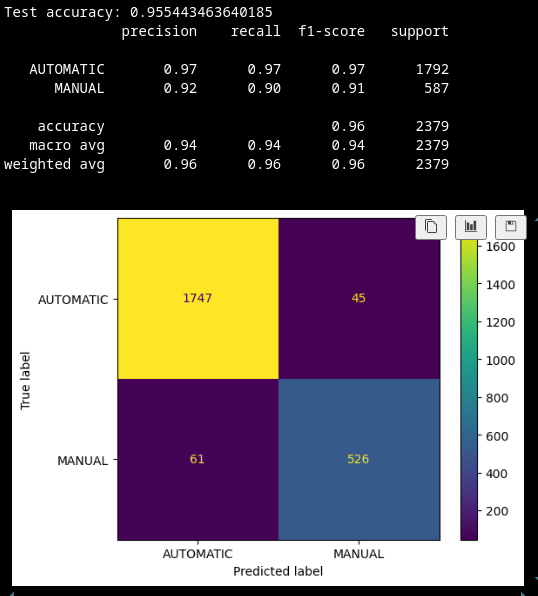
*Satunnaismetsä 14:sta puulla.*

Kokeilen myös muuttaa RandomForestClassifierin max_depth-parametria. Huomaan puun tulosten huononevan, kun max_depth on alle 30. Antaakseni räikeän esimerkin, seuraavassa kuvassa on 15:sta puun satunnaismetsän tulokset.

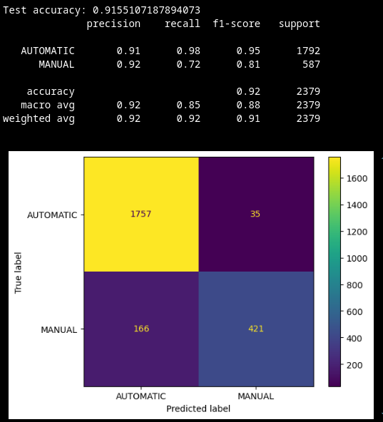
*Satunnaismetsä maksimisyvyydellä 15.*

Tässä datassa on selkeästi niin monta muuttujaa, että puut tarvitsevat syvyyttä voidakseen ennustaa oikean tuloksen.

## Lähteet

[^sourander]: Jani Sourander. Kurssimateriaali.

[^ibmtree]: IBM. What is a decision tree? https://www.ibm.com/think/topics/decision-trees

[^khanentropy]: Khan Academy. FI
Information entropy | Journey into information theory | Computer Science. https://www.youtube.com/watch?v=2s3aJfRr9gE

[^geekgini]: GeeksforGeeks. https://www.geeksforgeeks.org/machine-learning/gini-impurity-and-entropy-in-decision-tree-ml/

[^ibmforest]: IBM. What is a random forest? https://www.ibm.com/think/topics/random-forest