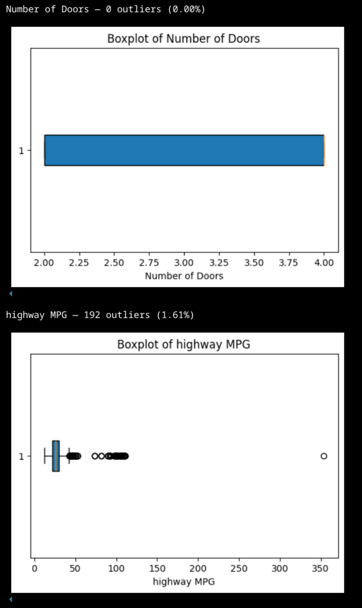
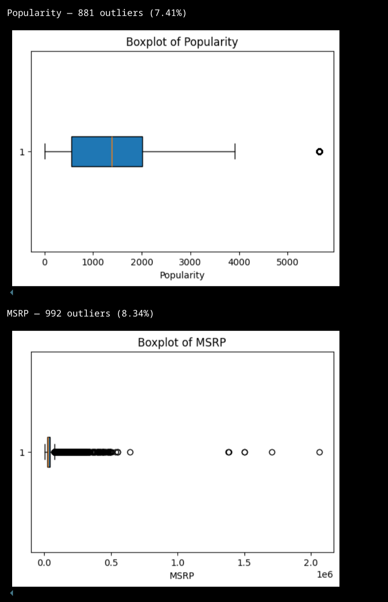
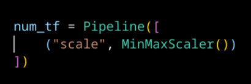
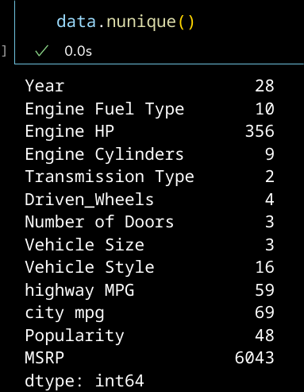
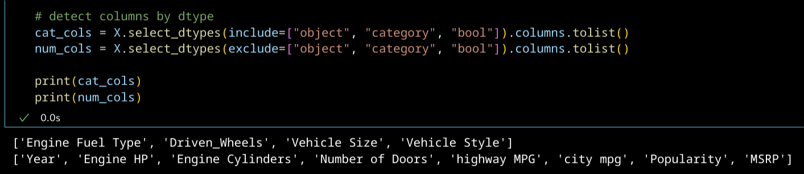
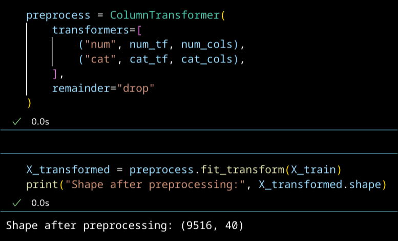
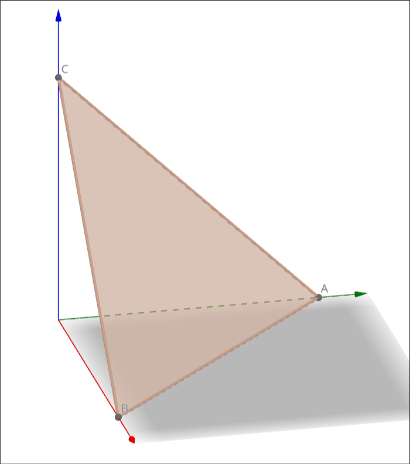
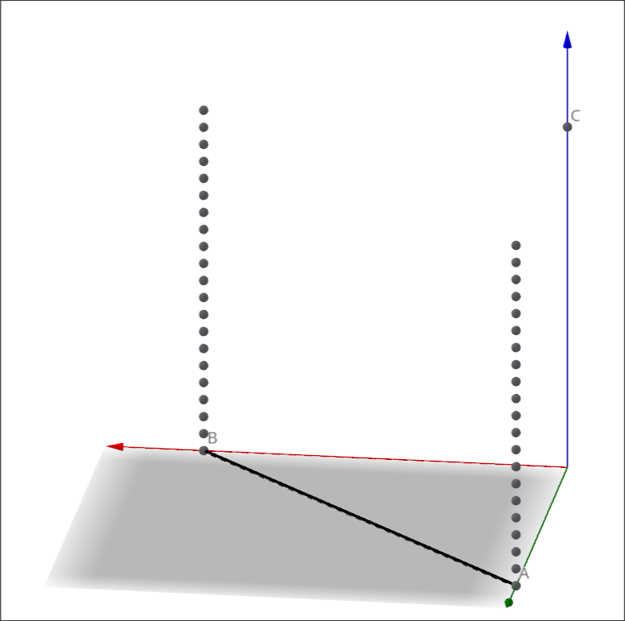
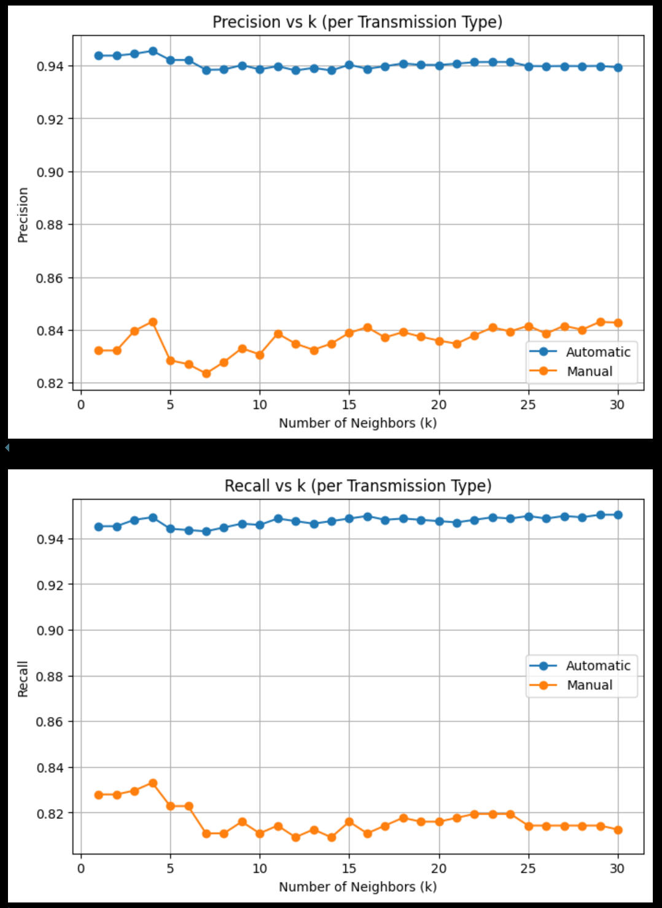
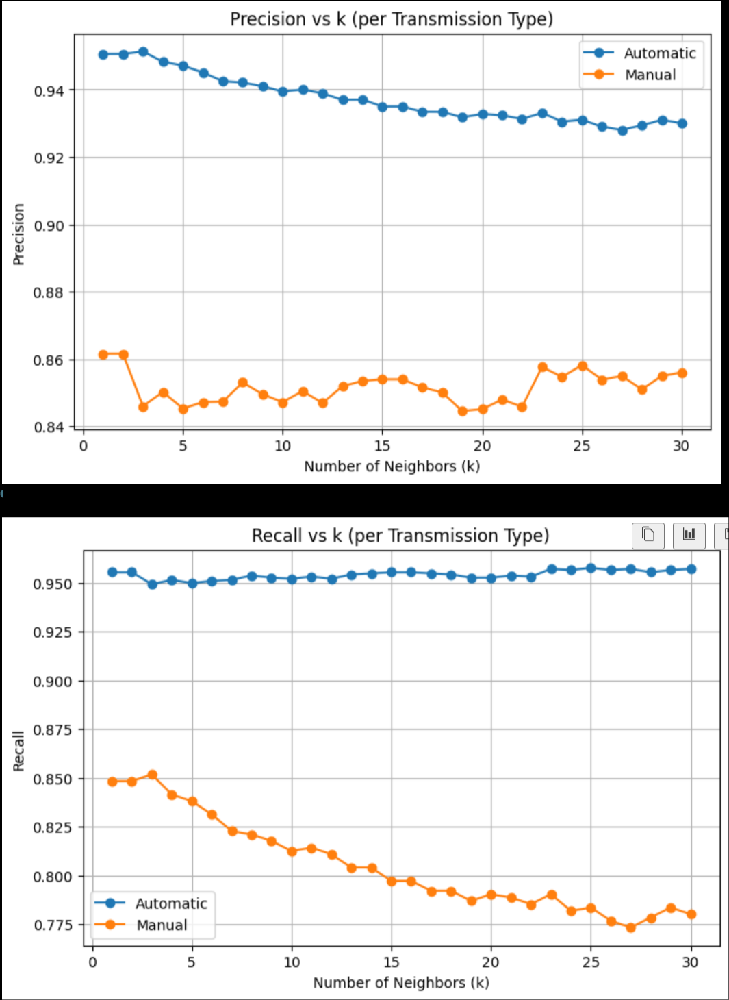

# 41: k-NN

## k-NN -algoritmin toimintaperiaate

k-Nearest Neighbors -algoritmin perustoimintaperiaate on, että datapiste luokitellaan perustuen sen etäisyyteen muista datapisteistä. Algoritmi etsii k lähintä pistettä, ja määrittää pisteen luokan sen mukaan, mikä luokka on eniten edustettu näissä lähimmissä pisteissä. Etäisyys on Minkowski-etäisyys, ja se voidaan mitata N-ulotteisessa avaruudessa.[^cornellknn][^sourander]

k-NN -algoritmi menettää suorituskykyänsä, kun avaruuden ulottuvuuksien määrä kasvaa. Tämä johtuu siitä, että ulottuvuuksien kasvaessa samanlaiset pisteet eivät enää välttämättä ole lähellä toisiaan. Jos ajatellaan tilannetta, jossa datapisteet ovat jakautuneet tasaisesti avaruuteen, ja jonkin pisteen lähimmät pisteet rajataan hyperkuution avulla, huomataan että avaruuden ulottuvuuksien määrän kasvaessa hyperkuution sivun pituus lähestyy koko avaruuden sivun pituutta. Tälle ilmiölle on englanninkielinen termi *the curse of dimensionality*.[^cornellknn]

## Tehtävä: Automaattivaihteet (Pt. 2)

Tällä algoritmilla dataa pitää lähestyä erilaisella tavalla. Algoritmi mittaa datapisteiden etäisyyksiä avaruudessa, eli kaikkien piirteiden tulee olla numeerisia. Valmiiksi numeeriset piirteet skaalataan. Kategoriset piirteet tulee enkoodata. Tämän voi tehdä one-hot enkoodauksella, jos piirteellä ei ole liian paljon eri vaihtoehtoja. Syy on *curse of dimensionality*. One-hot enkoodaus lisää piirteiden ja siten ulottuvuuksien määrää. Tästä syystä katson attribuuttien *Make* ja *Model* olevan käyttökelvottomia k-NN algoritmin kanssa.

### Datan analysointi

Joissain numeerisissa piirteissä on nähtävissä suuri outliereiden vaikutus. Arvelen, että datan käsittely tavalla, joka käsittelee outlierit voisi olla hyödyllistä.

*Joissain muuttujissa outlierit ovat vaikuttavat erittäin voimakkaasti.*

*Popularity-piirteen tapauksessa outlierien vaikutus on maltillinen. MSRP:n tapauksessa vaikutus on äärimmäinen.*

### Outliereiden käsittely

Käytän Yeo-Johnson-muunnosta, koska Box-Cox ei kykene käsittelemään datassa olevia nollia. Yeo-Johnson suorittaa epänegatiivisille arvoille Box-Coxin, mutta lisää niihin 1:n. Muunnoksen tarkoituksena on saada data muistuttamaan enemmän normaalijakaumaa.[^yeo]

$$
T(y; \lambda) =
\begin{cases}
\dfrac{(y + 1)^{\lambda} - 1}{\lambda}, & \text{if } \lambda \neq 0, \\[10pt]
\log(y + 1), & \text{if } \lambda = 0
\end{cases}
$$

Seuraavasta kuvasta näemme, että muunnoksen vaikutus on ollut suuri erityisesti MSRP:hen. Laatikkokaavio osoittaa, että datapisteet eivät ole enää niin rajusti keskittyneet yhdelle kapealle alueelle.

*Esimerkki Yeo-Johnson-muunnoksen vaikutuksesta dataan.*

### Datan skaalaaminen ja enkoodaaminen

Skaalaan numeeriset muuttujat scikit-learnin MinMaxScalerilla. Oletusarvoisesti se skaalaa jokaisen piirteen erikseen välille [0, 1]. Täten jokainen piirre on skaalattu samaan mittakaavaan. Kategoriset muuttujat enkoodaan OneHotEncoderilla.

Jokainen numeerinen piirre ja jokainen kategorisen piirteen vaihtoehto luo uuden ulottuvuuden piirreavaruuteen. Numeeriset piirteet luovat 8 ulottuvuutta, ja kategoriset muuttujat luovat 33 ulottuvuutta. Datassa pitäisi siis olla yhteensä 41 ulottuvuutta.

Datassa näyttää sittenkin olevan 40 ulottuvuutta. Oletan tämän johtuvan siitä, että yksi one-hot enkoodattu ulottuvuus on pudotettu pois.

### Miten data jakautuu avaruudessa, kun käytetään one-hot enkoodausta

Seuraava on omaa päättelyäni.

Ajattelin, että minkälaisiin geometrisiin muotoihin one-hot enkoodauksen binäärinen luonne muovaisi datan. Tämä on oleellista, koska k-NN-algoritmi mittaa datapisteiden välisiä etäisyyksiä.

Kuvassa 1 on yksi kategorinen muuttuja, joka on enkoodattu 3:ksi piirteeksi. Kuvassa 2 on yksi kategorinen muuttuja, joka on enkoodattu 2:ksi piirteeksi, sekä yksi numeerinen piirre.

Kuvan 1 tilanteessa datapiste voi sijaita pisteissä A = (1,0,0), B = (0,1,0) ja C = (0,0,1). Kuvassa 2 datapiste voi sijaita pisteissä A = (1,0,z) ja B = (0,1,z), joissa z numeerisen muuttujan arvo. Huomaamme, että one-hot enkoodattujen piirteiden mahdolliset arvot sijoittuvat `k-1` -ulotteisen simpleksin kärkiin, jossa k on enkoodatun a 2 on yksiulotteinen simpleksi eli jana. 

Kuvassa 2 näemme, että datapisteet jakautuvat 3:nnessa ulottuvuudessa 2-ulotteisen simpleksin kärkien yläpuolelle janoille. Näin tapahtuu, koska 3:ssa ulottuvuudessa oleva muuttuja on numeerinen, eli sillä on jatkuva arvoalue eikä se ole riippuvainen kategoristen piirteiden arvoista. Voimme myös päätellä, että jos kuvaan tulisi toinen numeerinen piirre, jonka arvot olisivat neljännessä ulottuvuudessa, tämä piirre muodostaisi toisen numeerisen piirteen kanssa 2-ulotteisen tason muotoisen arvoalueen. Tätä päätelmää voidaan jatkaa lisäämällä ulottuvuvuuksia. Lopuksi päädytään siihen, että huomataan arvoavaruuden jakautuvan n-ulotteisiin aliavaruuksiin, joissa n on numeeristen muuttujien määrä. Kategoristen piirteiden binäärinen luonne luo epäjatkuvuuskohtia, mikä erottaa nämä aliavaruudet toisistaan.

Voidaan siis päätellä, että one-hot enkoodauksella on vahva klustereita erottava vaikutus. 

*Kuva 1*

*Kuva 2*

### k-NN-algoritmin ajaminen

#### Ilman outliereiden käsittelyä

Malli on huonompi tunnistamaan manuaalivaihteisia kuin automaattivaihteisia autoja. Tämän arvelen johtuvan siitä, että koulutusdatassa on huomattavasti enemmän automaattivaihteisia kuin manuaalivaihteisia autoja. Manuaalivaihteisia ja automaattivaihteisia autoja erottavat piirteet ovat myös hyvin samanlaisia, mikä tekee vaihteistotyyppien erottelemisesta vaikeampaa. 

Tällä datalla eri k-arvot eivät suuresti muuta ennustuksen tarkkuutta. K-NN-algoritmin luonteesta päätellen arvelen tämän johtuvan siitä, että data on outliereiden vinoamana jakautunut tiiviisiin klustereihin siten, että pienet muutokset tietyissä arvoissa eivät anna tarpeeksi tietoa datapisteen oikeasta luokasta.

*Algoritmin kyky tunnistaa automaattivaihteiset ja manuaalivaihteiset autot, kun datan jakaumaa ei ole muunnettu.*

#### Oultierit käsitelty

Kun outlierit käsitellään Yeo-Johnson-muunnoksella, algoritmin suorituskyky paranee hieman. Tästä voidaan päätellä, että muunnos on toiminut hyvin ja lisännyt piirteiden merkityksellisyyttä.

Huomataan myös, että suorituskyky laskee k:n kasvaessa. 3:n jälkeen alkaa selvä alamäki. Tästä voidaan päätellä, että algoritmi on muunnetulla datalla onnistunut tunnistamaan pienempiä alueita, joilla luokitella datapisteet.

*Algoritmin kyky tunnistaa automaattivaihteiset ja manuaalivaihteiset autot, kun datan jakauma on muunnettu Yeo-Johnson-muunnoksella.*

## Lähteet

[^cornellknn]: Kilian Weinberger. CS4780/CS5780: Machine Learning for Intelligent Systems [FALL 2018], Lecture 2: k-nearest neighbors. https://www.cs.cornell.edu/courses/cs4780/2018fa/lectures/lecturenote02_kNN.html

[^sourander]: Jani Sourander. Kurssimateriaali.

[^yeo]: Vandita Gupta. Yeo-Johnson Transform. https://www.geeksforgeeks.org/machine-learning/yeo-johnson-transform/

