# 42: K-means

## K-means -algoritmin toimintaperiaate

K-means on ohjaamaton klusterointialgoritmi. Se on eksklusiivinen, eli piste voi kuulua vain yhteen klusteriin. Algoritmin perusperiaate on, että data jaetaan k klusteriin sentroidejen avulla. Sentroidi on klusterin keskipiste, joka sijaitsee paikassa jossa on klusterin pisteiden keskiarvo tai mediaani. Tavoitteena on, että sentroidit löytävät tiensä klusterien oikeisiin keskipisteisiin, eli että klusterin pisteiden ja sentroidin etäisyyksien summa on mahdollisimman pieni. K:n ollessa suuri, data jaetaan moneen pieneen klusteriin eli klusterointi on yksityiskohtaista. Kun k on pieni, data jaetaan pienempään määrään suuria klustereita.[^ibmkmeans][^isotropic]

K-means olettaa klusterien olevan kuperia ja isotrooppisia. Isotrooppisuus tarkoittaa, että jonkin ominaisuudet ovat samat vaikka sitä mittaisiin eri suunnista. Käytännössä tämä tarkoittaa, että k-means olettaa klustereiden olevan pallon muotoisia.[^skclustering]

Algoritmin suorituskyky riippuu vahvasti sentroidien alustamisesta. Scikit-learnin k-means käyttää oletusarvoisesti k-means++ -alustusjärjestelmää. Sen tarkoituksena on valita sentroideille aloituspaikat, jotka johtavat oikeanlaiseen klusterointiin. Sen toimintaperiaate on, että sentroidit valitaan yksi toisensa jälkeen. Ensimmäinen sentroidi valitaan satunnaisesti datapisteiden joukosta. Seuraava sentroidi valitaan datapisteiden joukosta niin, että datapisteen todennäköisyys tulla valituksi on verrannainen sen etäisyyden neliöön sitä lähimmästä sentroidista. Tätä toistetaan iteratiivisesti, kunnes sentroideja on k määrä. Näin sentroidit alustetaan todennäköisesti kauaksi toisistaan, mikä parantaa algoritmin suorituskykyä. Ilman tätä alustusta, jos sentroidit alustettaisiin täysin satunnaisesti, voisi tulla vastaan tapauksia joissa huonon alustuksen takia esimerkiksi selvä klusteri jakautuisi kahtia kahden sentroidin välillä.[^kmeansplusplus][^skkmeans]

## Tehtävä: Värikartta

[3D HSV-visualisaatio saatavilla täältä](hsv_visualization_fruit.jpg.html).

[3D RGB-visualisaatio saatavilla täältä](rgb_visualization_fruit.jpg.html).

### RGB- ja HSV-värimallit

RGB-värimallissa värit esitetään punaisen, vihreän, ja sinisen valon arvojen yhdistelmänä. Arvoja voidaan ajatella kuution särmien pituuksina. HSV-värimallissa värit kuvataan sävyn (hue), kylläisyyden (saturation) ja kirkkauden (value) arvoina. HSV:ssä väriavaruus on sylinterin muotoinen. Sävyä kuvataan kulmana (0-360 astetta), kylläisyyttä etäisyytenä keskilinjasta ja kirkkautta etäisyytenä pohjasta.[^colormodels]

### Värien jakaauntuminen datassa, vertailu RGB:n ja HSV:n välillä.

Kurssimateriaalissa on lause: "Jos käytät RGB-arvoja, lopputulos ei välttämättä edusta sitä, kuinka ihminen jakaisi värit." Siinä myös kannustetaan pohtimaan, miksi hedelmäkuvassa oleva vihreä ei päässyt värikarttaan mukaan.[^sourander]

Etsin vastausta visualisoimalla hedelmäkuvan (kuva 5) pikselit RGB- ja HSV -värimalleissa. Kuvista 1 ja 2 näemme, että sekä RGB- että HSV -väriavaruuksissa muodostuu selkeitä klustereita. RGB-mallin klusterit näyttävät kuitenkin venytetyiltä verrattuna HSV-mallin klustereihin. Venyminen tapahtuu kasvavan vaaleuden suunnassa. Tämä johtuu siitä, että RGB-mallissa väristä saadaan vaaleampi nostamalla sen RGB-arvoja. Yhden arvon kolmesta nostaminen ei riitä, koska jos niin tehtäisiin, väri muuttuisi ihmissilmän nähden aivan toiseksi väriksi. Jos halutaan saada aikaan vaikutelma värin vaalenemisesta, kaikkia kolmea arvoa tulee nostaa. Tämä johtaa väriklustereiden venymiseen.

Kuvassa 3 näemme, kuinka vihreän värin klusteri on venynyt pitkäksi. Lisäksi näemme, kuinka sen vieressä on pitkä harmaan klusteri. Kuvasta 4 taas näemme, kuinka HSV-mallissa vihreä on erottunut selvästi omaksi klusterikseen. Tämä onnistui, koska HSV-mallissa sävy erottaa erilaiset värit selvästi toisistaan. Voimme päätellä, että tehtävänannon värikartan luontiin käytetty klusterointialgoritmi ei löytänyt vihreätä RGB-värimallin avaruudesta, koska vihreä ei ollut algoritmin nähden tarpeeksi erillään muista väreistä. Tähän viittaa myös aiemmin todettu tosiasia, että k-means olettaa klusterien olevan isotrooppisia. RGB-mallissa värit jakautuvat huomattavasti vähemmän isotrooppisiin klustereihin, kuin HSV-mallissa.

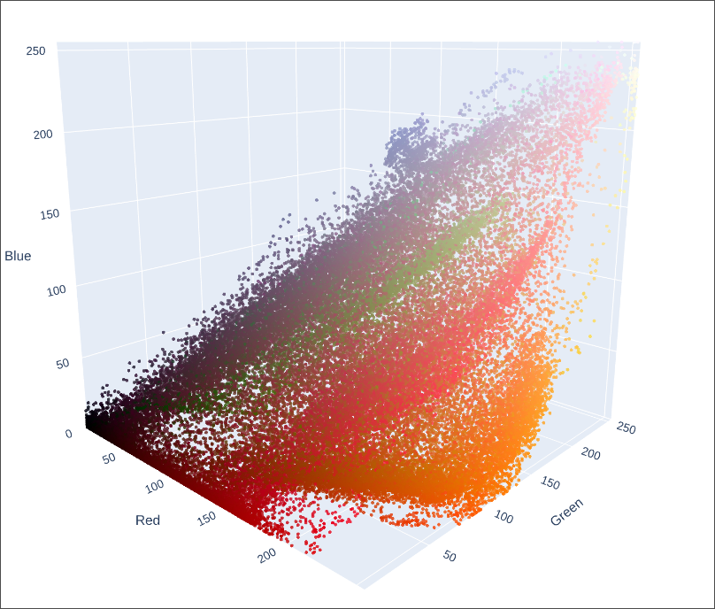
*Kuva 1. Pikseleiden jakautuminen RGB-värimallissa.*

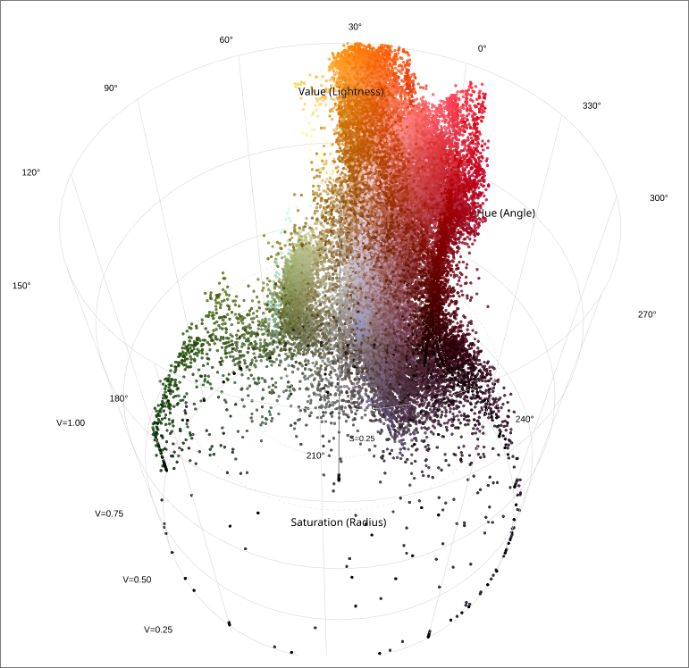
*Kuva 2. Pikseleiden jakautuminen HSV-värimallissa.*

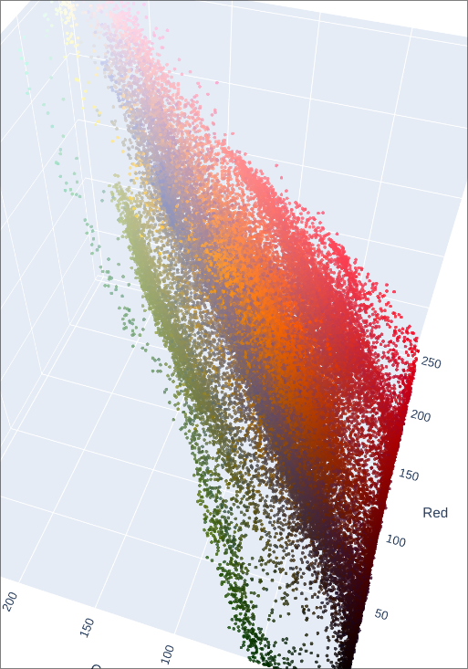
*Kuva 3. RGB-mallissa klusterit ovat venyttyneet nurkasta nurkkaan kirkkauden kasvun suuntaisesti.*

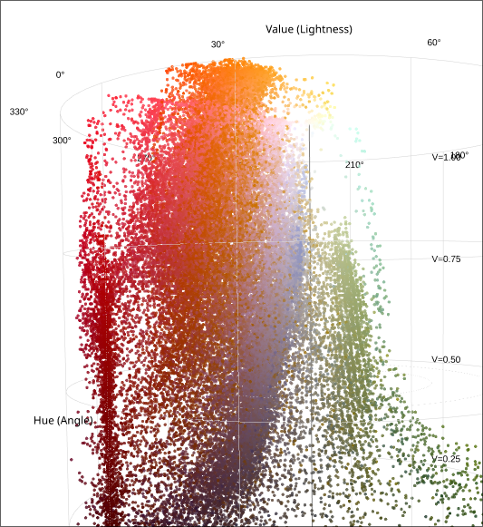
*Kuva 4. HSV-mallissa vihreä klusteroituu tiiviimmin.*

*Kuva 5. Kuva, josta pikselit otettiin.*

### K-NN: RGB vs HSV

#### Enkoodaaminen ja algoritmin ajaminen

RGB-mallilla klusterointi ei vaadi datan lisäkäsittelyä. Voimme syöttää pikselit niiden RGB-arvoina. Labels on NumPy ndarray, joka kertoo mihin klusteriin jokainen pikseli kuuluu. Tätä käytetään myöhemmin väriliuskan tekemiseen. Centers on ndarray, joka sisältää löydettyjen sentroidien koordinaatit.

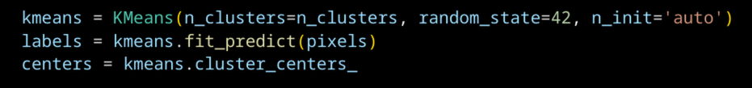
*Kuva 6. RGB-värimallin klusterointi.*

HSV-mallissa sävy on syklinen muuttuja. Se pitää enkoodata, jotta todellisesti toisiaan lähellä olevat arvot 0 ja 360 eivät olisi algoritmin silmissä toisistaan kaukana. Kuten tehtävänannossa kerrotaan, tämä voidaan tehdä sinillä ja kosinilla.

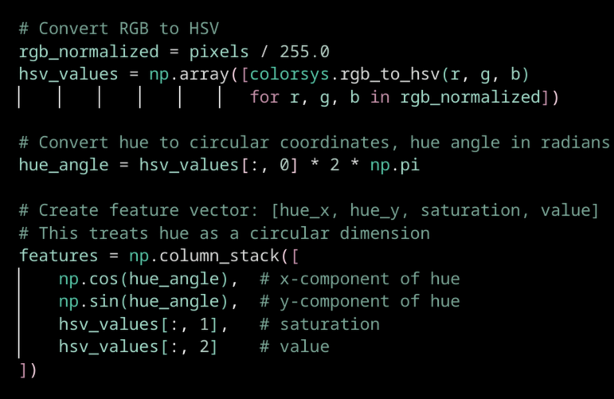
*Kuva 7. Sävyn syklinen enkoodaus.*

#### Suorituskyky

Havaitaan, että RGB-mallissa kaksi sentroidia sijaitsevat nähtävästi eri värialueiden välissä (vihreä ja violetti). Tämän voidaan päätellä johtuvan siitä, että k-means olettaa klustereiden olevan isotrooppisia. Tämä johtaa siihen, että algoritmi ei suoriudu hyvin pitkittyneillä klustereilla, ja sijoittaa sentroidit kohtiin jotka algoritmin silmissä *näyttävät* isotrooppisien klustereiden keskuksilta.

HSV-mallissa värit ovat ihmissilmään nähden luonnollisemmin toisistaan erotetut. Tämä on sen ansiota, että sävy on irrotettu vaaleudesta ja kylläydestä. Näin saman näköiset värit pysyvät toisiaan lähellä, ja eri näköiset värit ovat toisistaan kaukana. Tästä seuraa, että klusterit ovat isotrooppisempia, mikä johtaa siihen, että sentroidit sijoittuvat ihmissilmään nähden järkeviin kohtiin.

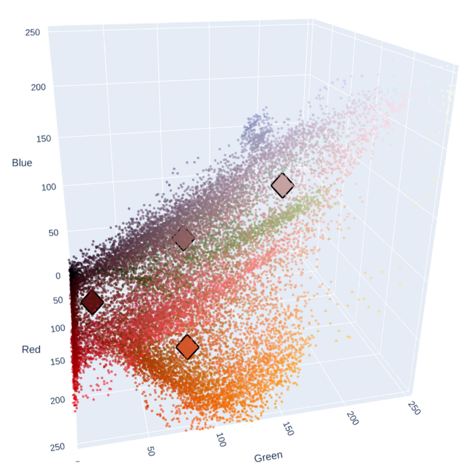
*Kuva 8. Sentroidien sijainti RGB-avaruudessa.*

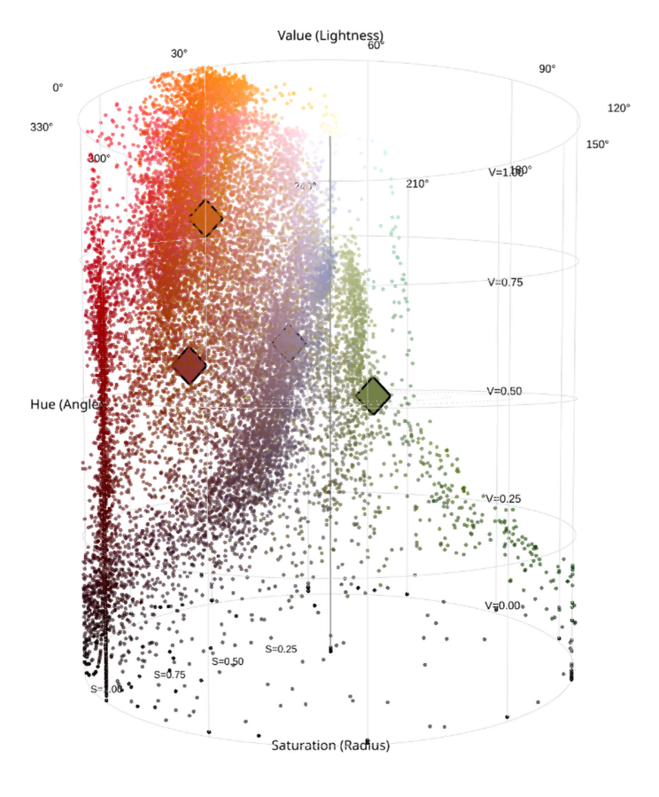
*Kuva 9. Sentroidien sijainti HSV-avaruudessa.*

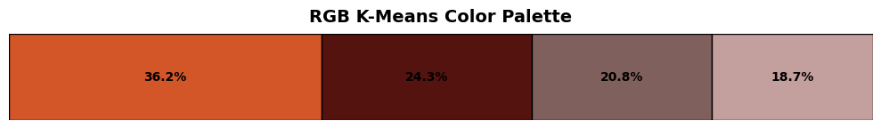
*Kuva 10. RGB tuottaa saman värikartan, kuin tehtävänannossa.*

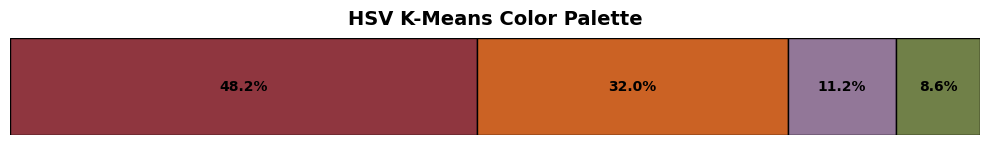
*Kuva 11. HSV tuottaa värikartan, jossa on vihreä väri.*

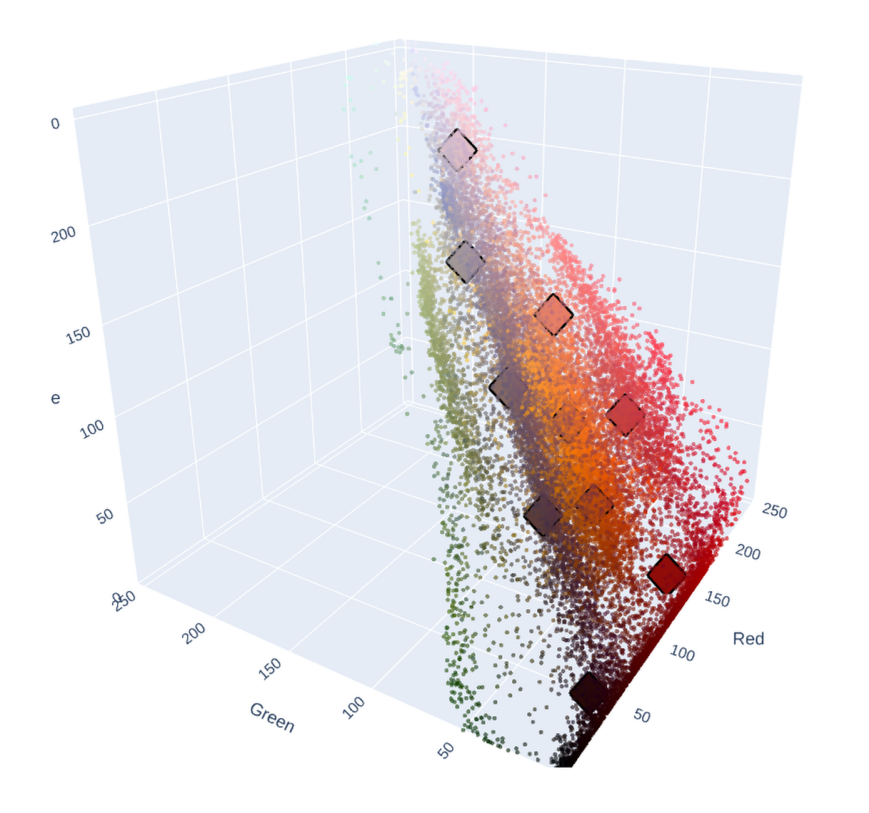
*Kuva 12. RGB-mallissa k-NN ei löydä vihreää, vaikka k olisi 10. Verrattuna HSV:hen, sentroidit myös sisältävät enemmän toisiltaan näyttäviä värejä.*

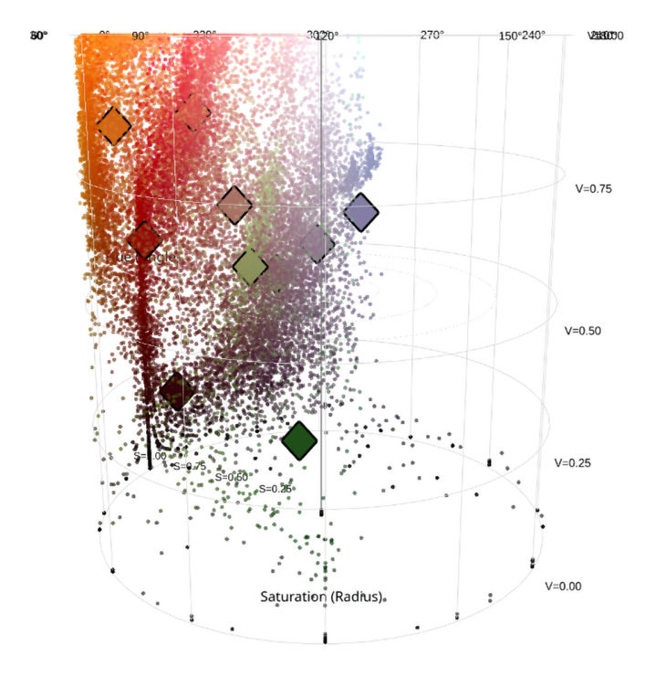
*Kuva 13. HSV-mallissa k-NN löytää toisen vihreän sävyn, kun k on 10. Lisäksi sentroidit sisältävät enemmän toisistaan erilaisilta näyttäviä värejä.*

## Toiset klusterointialgoritmit

On algoritmeja, jotka eivät kärsi k-means-algoritmin heikkouksista. Esimerkkinä DBSCAN, joka erottaa klusterit toisistaan tiheyden perusteella. Klusterit ovat suuren tiheyden alueita, jotka ovat alhaisen tiheyden alueiden rajaamia. Tämä johtaa siihen, että toisin kuin k-means, algoritmi pystyy käsittelemään minkä tahansa muotoisia klustereita. DBSCAN:in yksi heikkous on, että se olettaa eri klusterien tiheyden olevan sama. Tämän ongelman ratkaisemiseksi on kehitetty HDBSCAN-algoritmi, jonka haittapuolena on huonompi skaalautuvuus. DBSCAN löytää klustereiden määrän itse, eli se ei palauta ennalta määrättyä määrää klustereita.[^skclustering] 

Voimme päätellä, että DBSCAN-algoritmi ei välttämättä sovellu värien löytämiseen värikartta tehtävässä, koska klusterien tiheydet vaihtelevat. Vaihtelu johtuu siitä, että joillain väreillä on kuvassa enemmän pikseleitä, kuin toisilla. HDBSCAN taas voisi toimia.

## Lähteet

[^ibmkmeans]: Eda Kavlakoglu, Vanna Winland. What is k-means clustering?. https://www.ibm.com/think/topics/k-means-clustering

[^colormodels]: Rune Madsen. Programming Design Systems, Color models and color spaces. https://programmingdesignsystems.com/color/color-models-and-color-spaces/index.html
 
[^sourander]: Jani Sourander. Kurssimateriaali.

[^skclustering]: scikit-learn. Clustering. https://scikit-learn.org/stable/modules/clustering.html#dbscan

[^skkmeans]: scikit-learn. KMeans. https://scikit-learn.org/stable/modules/generated/sklearn.cluster.KMeans.html

[^isotropic]: Cambridge Dictionary. isotropic. https://dictionary.cambridge.org/dictionary/english/isotropic

[^kmeansplusplus]: Pulkit Sharma. K-Means Clustering Algorithm. https://www.analyticsvidhya.com/blog/2019/08/comprehensive-guide-k-means-clustering