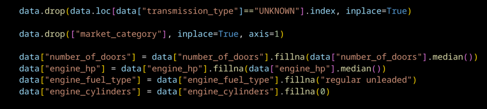
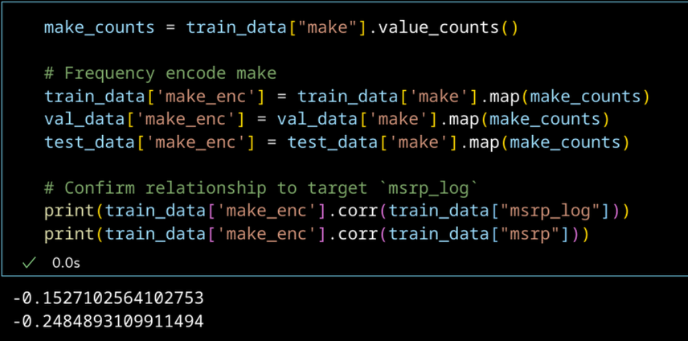
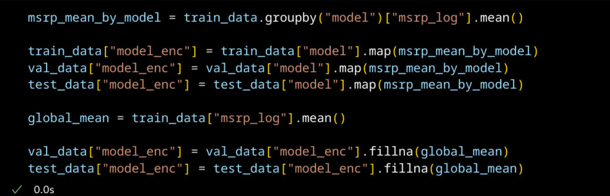
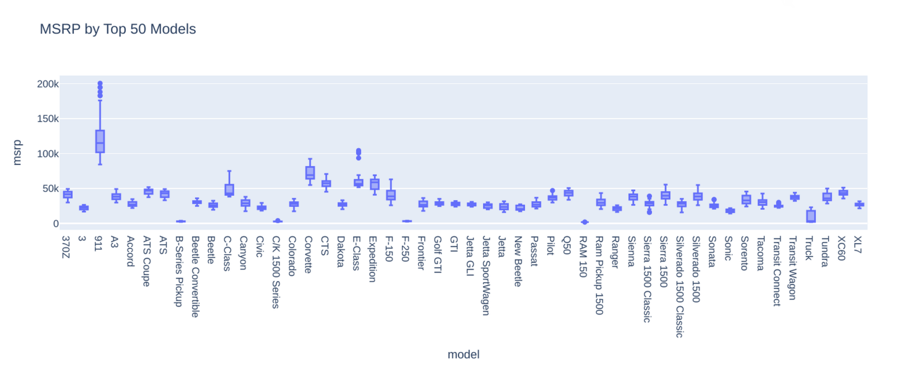
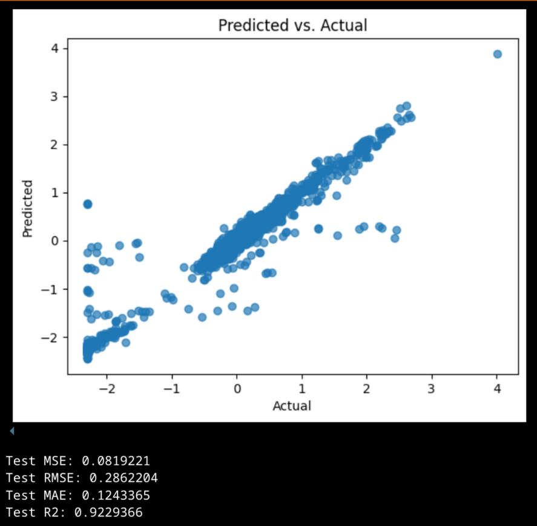

# 43: Lineaarinen regressio

## Toimintaperiaate

Lineaarisessa regressiossa ennustetaan jonkun muuttujan arvoa perustuen jonkun toisen muuttujan arvoon. Lineaarinen regressio sovittaa dataan suoran viivan, tason tai hypertason. Oikeaan tulokseen päästään minimoimalla keskimääräinen neliövirhe (Mean Square Error).[^sourander]

$$
MSE = \frac{1}{n} \sum_{i=1}^{n} (y_i - \hat{y}_i)^2
$$

Kaavassa `y_i` on y:n todellinen arvo ja `y_hat_i` on y:n ennustettu arvo. `y_hat_i` lasketaan seuraavalla kaavalla, jossa β tarkoittaa selittävän muuttujan kerrointa ja x tarkoittaa selittävän muuttujan havaintoa.

$$
\beta_0 + \beta_1 x_{i1} + \beta_2 x_{i2} + \cdots + \beta_k x_{ik}
$$

### Kuinka pääsemme normaaliyhtälön matriisimuotoon [^triveri]

Ennustettava muuttuja sovitetaan ennustaviin muuttujiin laskemalla ennustaville muuttujille kertoimet. Nämä kertoimet kertovat, kuinka paljon kukin ennustava muuttuja vaikuttaa ennustettavaan muuttujaan.

Kertoimet löydetään minimoimalla neliövirheiden summa. Neliövirheiden summan kaava on seuraava.

$$
\sum_{i=1}^{n} \varepsilon_i^2 = \sum_{i=1}^{n} (y_i - (\beta_0 + \beta_1 x_{i1} + \beta_2 x_{i2} + \cdots + \beta_k x_{ik}))^2
$$

Tämä kaava muutetaan matriisimuotoon 

$$
\varepsilon^T \varepsilon = (y - X\hat{\beta})^T(y - X\hat{\beta}).
$$

Tässä muodossa vektorioperaatiot vastaavat aiemman kaavan operaatiota. 

ε on (n x 1) matriisi, joka sisältää kaikkien havaintojen virheet. Kun se kerrotaan oman transpoosinsa kanssa, saadaan sen pistetulo itsensä kanssa eli virheiden neliösumma. 

$$
\sum_{i=1}^{n} \varepsilon_i^2
$$

y on (n x 1) matriisi, joka sisältää ennustettavan arvon havainnot.

$$
\sum_{i=1}^{n} y_i
$$

X on (n x p) matriisi, joka sisältää n havaintoa p ennustavalle muuttujalle. β on (p x 1) kokoinen matriisi, jossa on yksi kerroin per ennustava muuttuja. Xβ kertoo nämä yhteen ja edustaa seuraavaa osaa aiemmasta summamuotoisesta yhtälöstä. Tuloksena on (n x 1) matriisi, eli se voidaan vähentää y:n matriisista.

$$
\sum_{i=1}^{n} (\beta_0 + \beta_1 x_{i1} + \beta_2 x_{i2} + \cdots + \beta_k x_{ik})
$$

(n x 1) tulo oman transpoosinsa kanssa tuottaa skalaarin. Seuraavat kaksi yhtälöä hoitavat saman asian. Huomaan, että matriisinotaatio hoitaa eri indeksien summauksen eikä sigma notaatiota tarvita.

$$
\sum_{i=1}^{n} \varepsilon_i^2 = \sum_{i=1}^{n} (y_i - (\beta_0 + \beta_1 x_{i1} + \beta_2 x_{i2} + \cdots + \beta_k x_{ik}))^2
$$

$$
\varepsilon^T \varepsilon = (y - X\hat{\beta})^T(y - X\hat{\beta}).
$$

Matriisimuotoista yhtälöä voi käyttää β:n ratkaisemiseen. Se tulee derivoida β:n suhteen ja asettaa tulos 0:ksi. Derivaatan nollakohdassa on funktion minimiarvo. Lopuksi ratkaistaan β:n suhteen, ja saadaan yhtälö, jolla voidaan ratkaista kertoimet β.

$$
\hat{\beta} = {(X^{T}X)}^{-1}{X}^{T}y
$$

### Matriisimuodon geometrinen merkitys

Minua mietitytti, että mitä `X^T X` tarkoittaa. Paljastui, että siinä jokaisen piirteen havainnoista otetaan pistetulo jokaisen muun piirteen havaintojen kanssa. Tämä synnyttää (p x p) matriisin. Pistetulolla voi mitata, kuinka samaan suuntaan vektorit osoittavat. Tästä voimme päätellä, että matriisi `X^T X` näyttää kuinka paljon eri muuttujat kasvavat tai vähenevät toistensa kanssa.

Voimme tehdä samanlaisen päätelmän matriisin `X^T y` kohdalla. Tuloksena on (p x 1) matriisi, johon on laskettu pistetulot jokaisen piirteen havaintojen sekä y:n havaintojen välillä. Tästä voimme päätellä, että `X^T y` näyttää, kuinka paljon tulos y muuttuu piirteiden kanssa.

En tiedä, kuinka totta nämä päätelmät ovat, enkä löytänyt näihin liittyen mitään internetistä. Epäilen, että lineaarisen regression opetuksessa on aukko tässä kohtaa. Kukaan ei selitä, mitä normaaliyhtälön eri termit tarkoittavat intuitiivisella tasolla.

## Gradient descent

Oppimateriaali avasi käsitystäni koneoppimisen termeistä. Stable Diffusionia hienosäätäessäni olin nähnyt termin *learning rate*, mutta en ollut tutustunut siihen syvemmin. Nyt ymmärrän sen liittyvän käsitteeseen gradient descent. Luin asiasta lisää. Paljastui, että paljon Stable Diffusionin kanssa käytetyt Adam optimointialgoritmit perustuvat SGD:hen (stochastic gradient descent). Adam laskee jokaiselle parametrille oman oppimisnopeuden ja muuttaa sitä jokaisella oppimisaskeleella.[^adam] 

Stable Diffusionin kontekstissa olen nähnyt myös käsitteen *batch size*, joka päättää kuinka monta kuvaa käsitellään yhdessä oppimisaskeleessa. Näen tämän vastaavan oppimiateriaalissa esitettyä käsitettä *Mini-Batch Gradient Descent*. 

Oppimateriaalissa esitettiin myös käsite dynaamisesta oppimisnopeuden säädöstä. Adamin lisäksi oppimisnopeutta voi säätää aikatauluttajalla (scheduler). Aikatauluttaja asettaa globaalin oppmisnopeuden, jota Adam tai jokin muu adaptiivinen algoritmi käyttää pohjana. Olen nähnyt Stable Diffusionin hienosäädössä erilaisia käyriä seuraavia aikatauluttajia. Näkemäni päätyypit ovat vakio, lineaarisesti pienenevä ja kosinikäyrän mukaisesti pienenevä. 

## Tehtävä: Auton hinta

Katsoin esimerkkirepositorioita Kagglesta. Käyttäjän Cobra_Jet repositoriossa data oli analysoitu ja esikäsitelty erittäin hyvin, ja lineaarisen regression tulokset olivat todella hyvät. Repositoriossa autojen puuttuvat tiedot oli täytetty oikeaan tietoon perustuen, eikä laskemalla keskiarvoja tai yleisimpiä luokkia. Tämä on tositilanteessa hyvä toimintatapa, mutta en ala tekemään tätä itse, sillä se veisi aikaa jota minulla ei ole. Otan kuitenkin jonkin verran mallia repositoriosta.[^cobra] 

*Puuttuvat arvot täytetään samalla tavalla kuin aiemmissa tehtävissä.*

Käytän edellisen repositorion mukaisesti piirteelle make *frequency encodingia*. Siinä kategorisen piirteen kategoriat enkoodataan numeroiksi sen mukaan, kuinka monta kertaa kategoria esiintyy datasetissä. Tämä toimii lineaarisen regression kanssa, jos kategorioiden esiintymisyleisyydellä on lineaarinen suhde ennustettavaan muuttujaan. Autodatan tapauksessa tämä suhde näyttää olevan.[^frequency]

*Piirre make_enc korreloi MSRP:n kanssa. Mitä suositumpi merkki, sen pienempi hinta.*

Repositorio käyttää piirteelle model *target encodingia*. Target encodingissa kategorioille annetaan numeroarvo siitä, mikä ennustettavan muuttujan keskiarvo on kullakin kategorialla. Modelin tapauksessa target encoding sopii, koska automalli määrää auton hinnan melko tarkasti.[^target]

*MSRP:n hajonta eri automallien sisällä on pieni, ja malli ennustaa MSRP:tä melko tarkasti.*

Piirteen *Market Category* pudotan, koska minulla ei ole aikaa täyttää sen tyhjiä arvoja. Muut kategoriset piirteet one-hot enkoodataan kuin aiemmissa datasettiä käyttäneissä tehtävissä. Numeeriset piirteet standardisoidaan StandardScalerilla.

Lopputulos vaikuttaa varsin hyvältä. R2-arvon perusteella malli ennustaa 92% MSRP:n vaihtelusta. 

## Validaatio ja testaus

Arvelin, että mallina käyttämäni Kaggle-repositoriossa jaettiin turhaan testidatasetistä vielä validointidatasetti. Näen olleeni oikeassa.

Validaatiodatasetin tarkoitus on, että sitä käytettäisiin mallin hyperparametrien säätämiseen koulutuksen aikana. Repositoriossa ei tehdä näin. Siinä validaatiodatasettiä käytetään vain toisena testidatasettinä. Tämä sotki turhaan aivojani ja koodiani. Muutenkin lukemani perusteella validaatiodatasetti näyttää olevan vanhentuva ristivalidaation tieltä väistyvä käsite.[^validation]

## Lähteet

[^sourander]: Jani Sourander. Kurssimateriaali.

[^triveri]: James Triveri. Derivation of the Normal Equations. https://www.jtrive.com/posts/deriv-normal-equations/deriv-normal-equations.html

[^adam]: Jason Brownlee. 
Gentle Introduction to the Adam Optimization Algorithm for Deep Learning. https://machinelearningmastery.com/adam-optimization-algorithm-for-deep-learning/

[^cobra]: Cobra_Jet. Car Price Prediction-Linear Regression https://www.kaggle.com/code/reubenjosephisidoro/car-price-prediction-using-regression-models

[^frequency]: Let's Data Science. Frequency Encoding: Counting Categories for Representation. https://letsdatascience.com/frequency-encoding/

[^target]: Let's Data Science. Target Encoding: Categories Guided by Outcomes. https://letsdatascience.com/target-encoding/

[^validation]: Jason Brownlee. What is the Difference Between Test and Validation Datasets?. https://machinelearningmastery.com/difference-test-validation-datasets/