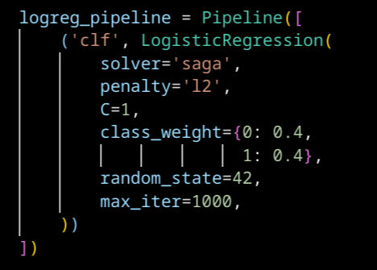
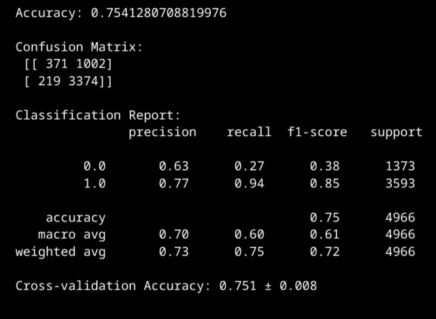
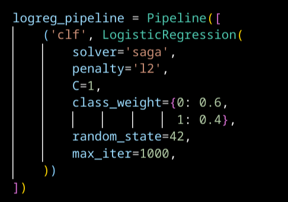
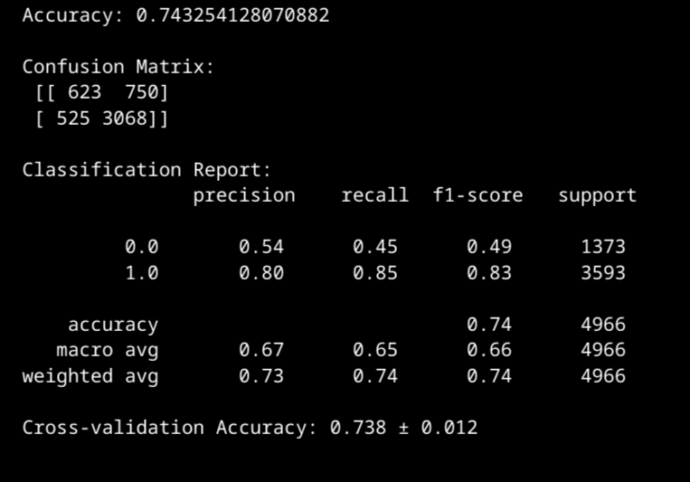

# 44: Logistinen regressio

Logistinen regressio on luokittelualgoritmi. Se on lineaarisen regression tapaan lineaarinen malli. Erona on, että lineaarista regressiota käytetään jatkuvan arvon ennustamiseen ja logistista regressiota diskreetin arvon ennustamiseen.

## Tehtävä: Kyberviha

Data oli valmisteltu tehtävää varten jo valmiiksi, joten sen käsittelystä ei ole sanottavaa.

### Mitä LogisticRegression -luokan parametrit tarkoittavat

Kokeilin eri parametreja LogisticRegression -luokalle. 

#### Solver

Solver tarkoittaa algoritmia, jolla lasketaan logistisen regression tulos. Algoritmeilla voi olla etuja toisiin nähden, esimerkiksi 'liblinear' ja 'saga' tukevat l1-regularisaatiota. Tässä tehtävässä havaitsin vain mitättömän pieniä eroja eri solvereiden tuloksien välillä. Scikit-learnin dokumentaatio sanoo, että 'saga' on yleensä nopeampi suurilla dataseteillä. Tämän tehtävän datasetti ei ole suuri, ja saga olikin muita algoritmeja huomattavasti hitaampi.[^solvers]

#### Penalty ja C

Tämä tarkoittaa mallin regularisointia. Sen tarkoituksena on estää mallin ylisovittuminen. Jos regularisaatio on liian vahva, malli voi alisovittua.[^reg]

L1 regularisaatio sopii tapaukseen, jossa kaikki piirteet eivät ole tärkeitä. L1 regularisoitu malli keskittyy vain suurimman vaikutuksen omaaviin piirteisiin. Tämä tehdään pienentämällä painoja perustuen niiden absoluuttiseen arvoon. Tämä pienentää erityisesti vähäisen merkityksen omaavia painoja, ja ne voivat laskea jopa nollaan.[^reg]

L2 regularisaatio sopii tapaukseen, jossa kaikki piirteet ovat arvokkaita. Se pienentää piirteiden painoja niiden neliöön perustuen. Tämä pienentää suuria painoja enemmän, kuin pieniä painoja. Tällä on tasapainottava vaikutus painojen tärkeyteen.[^reg]

Elastic Net yhdistää L1 ja L2 regularisaation. Siinä L1:n suhde L2:teen päättää kumpaa regularisaatiomenetelmää lähempänä tulos on.[^elastic][^reg]

C on regularisaation voimakkuuden käänteisarvo. Pienempi arvo tarkoittaa voimakkaampaa regularisaatiota.[^logreg]

#### Class weight

Python dict, jossa luokille annetaan painoarvo. Painoarvot ovat toisiinsa suhteellisia.[^logreg]

### Logistisen regressio kybervihadatalla

Pääsin odotettuun 75%:n tarkkuuslukuun, mutta tulokset eivät ole niin hyviä kuin tämä luku voisi antaa ymmärtää. Malli on huono tunnistamaan ei-kybervihan luokkaa 0, mikä nähdään alhaisesta recall-arvosta. Yritin saada mallia paremmaksi tunnistamaan luokan 0 muuttamalla mallin parametreja. Ainoastaan parametria *class_weight* säätämällä sain muutettua tulosta merkitsevästi haluamaani suuntaan. Painottamalla luokkaa 0 sain mallin paremmaksi tunnistamaan luokkaa 0, mutta tämän kääntöpuolena oli mallin yleisen suorituskyvyn huononeminen. Malli tunnisti huomattavasti suuremman osuuden luokan 0 esimerkeistä, mutta 0:ksi luokitelluista suurempi osa olikin luokkaa 1 (tarkkuus laski). Lisäksi malli tuli huonommaksi tunnistamaan luokkaa 1 (recall laski).

*Luokkien painot samat*

*Tulokset, kun luokilla oli samat painot*

*Luokkaa 0 painotettu*

*Tulokset, kun luokkaa 0 painotettiin*

## Lähteet

[^solvers]: scikit-learn. Logistic Regression, Solvers. https://scikit-learn.org/stable/modules/linear_model.html#logistic-regression-solvers

[^logreg]: scikit-learn. LogisticRegression. https://scikit-learn.org/stable/modules/generated/sklearn.linear_model.LogisticRegression.html

[^reg]: Ujang Riswanto. A Beginner’s Guide to L1 and L2 Regularization in Logistic Regression. https://ujangriswanto08.medium.com/a-beginners-guide-to-l1-and-l2-regularization-in-logistic-regression-ec93ed1dea4f

[^elastic]: scikit-learn. ElasticNet. https://scikit-learn.org/stable/modules/generated/sklearn.linear_model.ElasticNet.html